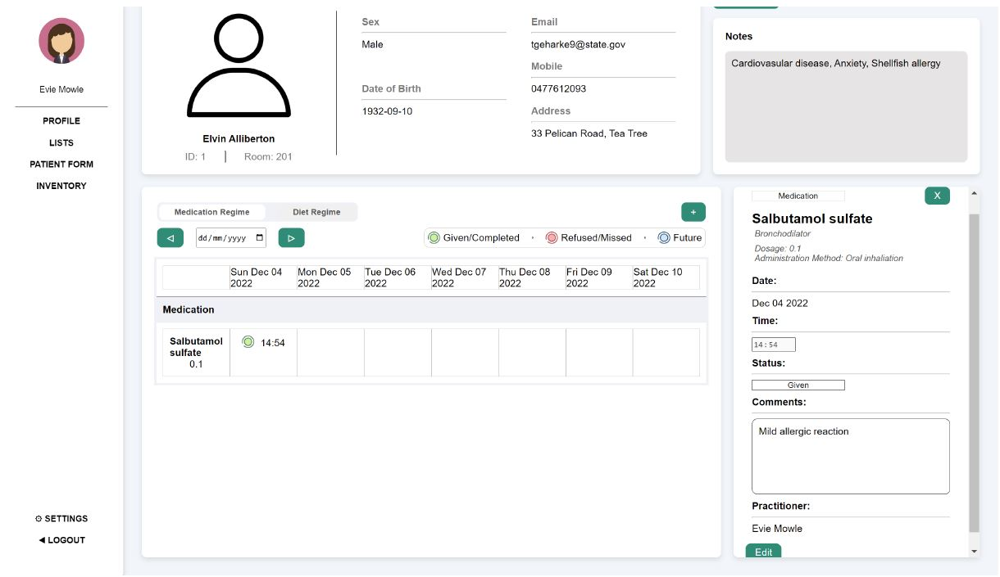

# A Web-Based Medication and Diet Regime Management System

___

A web-based medication and diet regime management system that would be suitable for use by a qualified health practitioner in an aged-care facility.

### Features

___

- practioner authentication
- filtered and ordered search of patient list
- insert, view and edit patient data
- display 7 days worth of regime (medication, exercise, meal) information - shiftable with arrow buttons or by date entered
- patient round information editable and can be deleted by practitioner in charge
- option to email facility director if medication is refused/not given

### Screenshots

___

